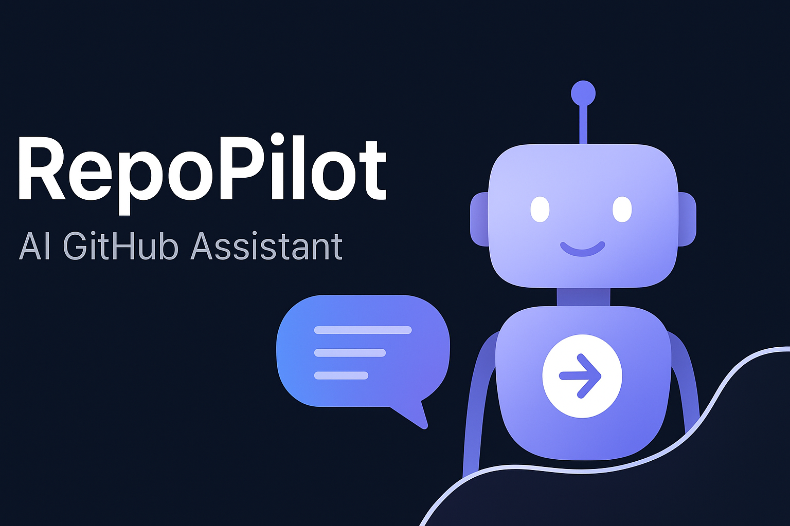
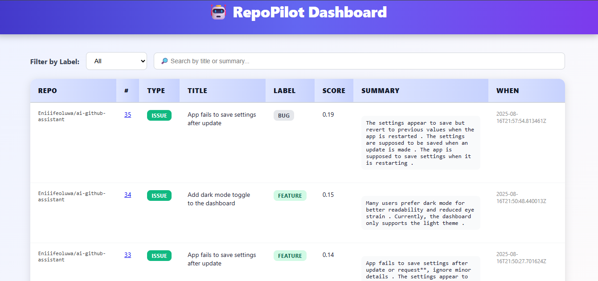

# 🚀 RepoPilot – AI GitHub Assistant

<div align="center">



**Intelligent GitHub workflow automation that understands your code**

[](https://opensource.org/licenses/MIT)
[](https://github.com/Eniiifeoluwa/RepoPilot/issues)
[](https://github.com/Eniiifeoluwa/RepoPilot/stargazers)
[](https://github.com/Eniiifeoluwa/RepoPilot/network)

[🎬 Demo](#-demo) • [⚡ Quick Start](#-quick-start) • [📊 Dashboard](#-dashboard) 
</div>

---

## 🎯 What is RepoPilot?

RepoPilot is an AI-powered GitHub workflow that **automatically analyzes**, **summarizes**, and **labels** your issues and pull requests. Built for developers who want to spend less time on triage and more time on what matters; writing great code.

### 🌟 Why RepoPilot?

- **⚡ Instant Analysis** — Get AI summaries and labels within seconds of creating issues/PRs
- **🧠 Smart Classification** — Predicts accurate labels like `bug`, `feature`, `documentation`, `enhancement`
- **📊 Beautiful Dashboard** — Track repository activity with an elegant web interface
- **💻 CPU Optimized** — Runs efficiently on standard GitHub Actions runners
- **🔧 Zero Configuration** — Works out of the box with minimal setup

---

## 🎬 Demo

<div align="center">

### Watch RepoPilot in Action
[](https://www.youtube.com/watch?v=5BahS4r4CRg)

*Click on the thumbnail to watch how RepoPilot automatically analyzes a new issue and provides intelligent insights*

</div>

---

## ⚡ Quick Start

Get RepoPilot running in your repository in under 2 minutes:

### 1️⃣ One-Click Setup

```bash
# Clone and navigate
git clone https://github.com/Eniiifeoluwa/RepoPilot.git
cd RepoPilot

# Install dependencies
pip install -r requirements.txt
```

### 2️⃣ GitHub Actions Integration

Create `.github/workflows/ai-helper.yml` in your repository:

```yaml
name: RepoPilot AI Assistant
on:
  issues:
    types: [opened, edited]
  pull_request:
    types: [opened, edited]

jobs:
  ai-analysis:
    runs-on: ubuntu-latest
    steps:
      - uses: actions/checkout@v3
      - name: Run RepoPilot
        uses: ./
        with:
          github-token: ${{ secrets.GITHUB_TOKEN }}
          dashboard-url: ${{ secrets.DASHBOARD_URL }}
```

### 3️⃣ Configure Secrets

In your repository settings, add these secrets:

| Secret | Description | Required |
|--------|-------------|----------|
| `GITHUB_TOKEN` | Automatically available in Actions | ✅ Yes |
| `DASHBOARD_URL` | Your deployed dashboard URL (e.g., `https://your-host.example`) | Essential |

---

## 🛠 Technology Stack

<div align="center">


</div>

---

## ✨ Features

<div align="center">

| Feature | Description |
|---------|-------------|
| 📝 **Smart Summaries** | Condenses complex issues and PRs into digestible insights |
| 🏷️ **AI Classification** | Predicts labels: `bug`, `feature`, `docs`, `question`, `enhancement` |
| 💬 **Auto Comments** | Posts analysis directly to GitHub with actionable insights |
| 🎯 **Auto Labeling** | Applies predicted labels automatically to save time |
| 📊 **Web Dashboard** | Beautiful interface to track and visualize repository activity |
| ⚡ **Performance** | Lightweight Hugging Face models optimized for speed |

</div>

### 🔥 What RepoPilot Does Automatically

When someone opens or edits an issue or PR, RepoPilot:

1. **🔍 Analyzes** the content using Large Language Models
2. **📝 Summarizes** key points and technical details  
3. **🏷️ Predicts** the most appropriate labels
4. **💬 Comments** with AI insights on the GitHub thread
5. **🎯 Labels** the issue/PR automatically
6. **📊 Updates** your web dashboard with new data

---

## 📊 Dashboard

<div align="center">



### Powerful Repository Insights at Your Fingertips

</div>

### 🎨 Dashboard Features

- **🔍 Smart Filtering** — Filter by labels, status, or date ranges
- **🔎 Quick Search** — Find issues by title, summary, or content
- **📈 Analytics** — Track issue trends and response times
- **🎯 Priority View** — Identify high-priority items at a glance
- **📱 Responsive** — Works beautifully on desktop and mobile

### 🚀 Run Dashboard Locally

```bash
# Start the FastAPI server
uvicorn main:app --reload --host 0.0.0.0 --port 8000

# Access dashboard at http://localhost:8000
```

---

## 🏗️ Installation & Setup

### Prerequisites

- Python 3.8+
- GitHub repository with Actions enabled
- Optional: Server for hosting the dashboard

### Detailed Installation

1. **Clone the Repository**
   ```bash
   git clone https://github.com/Eniiifeoluwa/RepoPilot.git
   cd RepoPilot
   ```

2. **Install Dependencies**
   ```bash
   pip install -r requirements.txt
   ```

3. **Set Up GitHub Actions**
   - Copy the workflow file to `.github/workflows/ai-helper.yml`
   - Customize triggers and parameters as needed

4. **Configure Repository Secrets**
   - Navigate to Settings → Secrets and variables → Actions
   - Add required secrets as listed above

5. **Deploy Dashboard (Optional)**
   ```bash
   # For production deployment
   gunicorn main:app -w 4 -k uvicorn.workers.UvicornWorker --bind 0.0.0.0:8000
   ```

---

## 🔧 Configuration

### Environment Variables

| Variable | Description | Default |
|----------|-------------|---------|
| `MODEL_NAME` | Hugging Face model for classification | `valhalla/distilbart-mnli-12-1` |
| `MAX_SUMMARY_LENGTH` | Maximum characters in summaries | `1500` |
| `DATABASE_URL` | SQLite database path | `./data/repopilot.db` |

## 📄 License

RepoPilot is available under the [MIT License](LICENSE).

---

<div align="center">

### ⭐ Star this project if it helped you!

**Made with ❤️ by Akinola, for developers**

[Report Bug](https://github.com/Eniiifeoluwa/RepoPilot/issues) • [Request Feature](https://github.com/Eniiifeoluwa/RepoPilot/issues) • [Documentation](https://github.com/Eniiifeoluwa/RepoPilot/wiki)

</div>